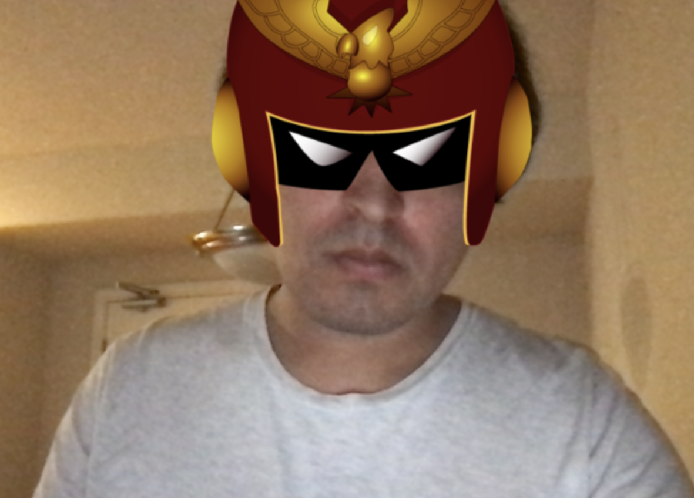

<!-- # Assignment 2: Make a reverse-engineered Snap Lens

Here are the requirements: 

1. VARIABLES: Activate at least one change in p5.js (display an image,run an animation,change the screen in some way, etc.) based on a poseNet keypoint position (this is an object with a x and y property).
2. EVENTS: Activate at least one change in p5.js based on an event (if you raise your hand, or if you make a certain gesture, etc.). 

## Here are the templates in this repo that you can use!

1. 
2. 
3. 
4. 

## Here are templates and resources you can find elsewhere.
1. 
2.  -->

# SEA Camera Lens

## Description

The lens I created was a helmet from a video game character called Captain Falcon. Upon doing a salute gesture with the left arm one can trigger Falcon's famous taunt phrase called "Show me ya moves".

## Screenshot



## Instructions to run the lens on local server

1. Open this repo with the terminal either through an IDE of choice or the system's terminal 
2. Run the repo through a server. If you do not have a server command already installed globally, run the command: 

```
npm install --global http-server
```

Else, run the following the command if you already have a server installed or after running the command above sucessfully:

```
http-server
```
3. Go to the browser and navigate to: localhost:8080
4. With the left hand, have your left hand show in front of the camera and you will hear a sound. Salute to make the lens effect look more dramatic. :)

## Tools used

- ml5.js
- p5.js
